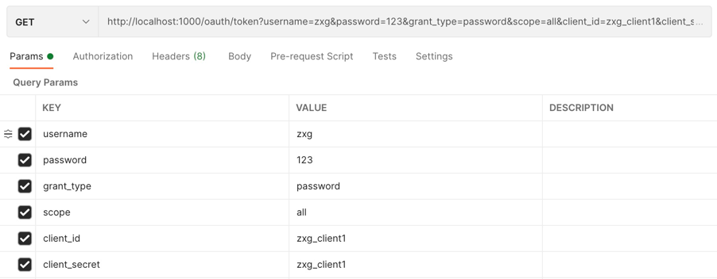
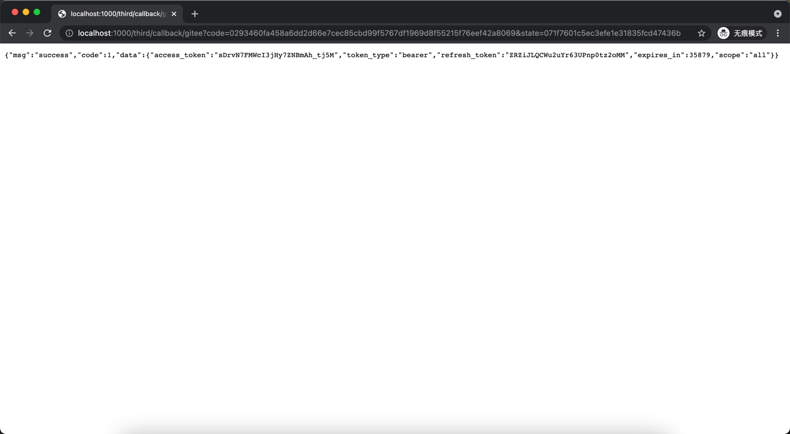
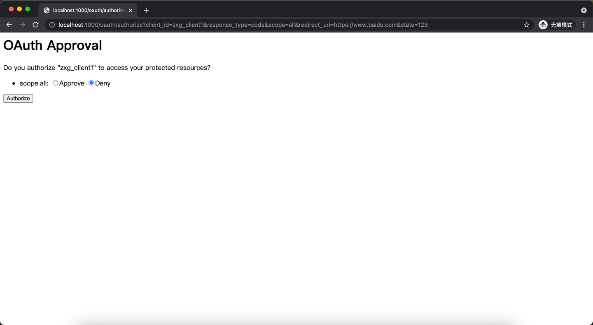
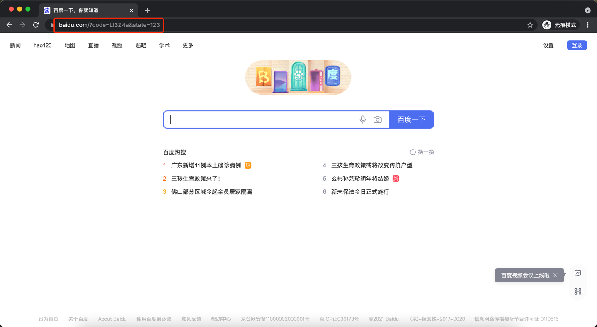
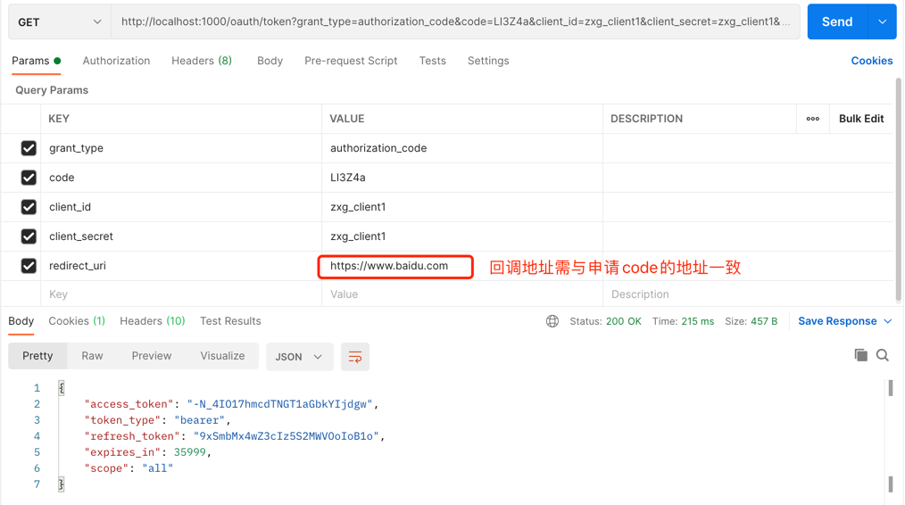
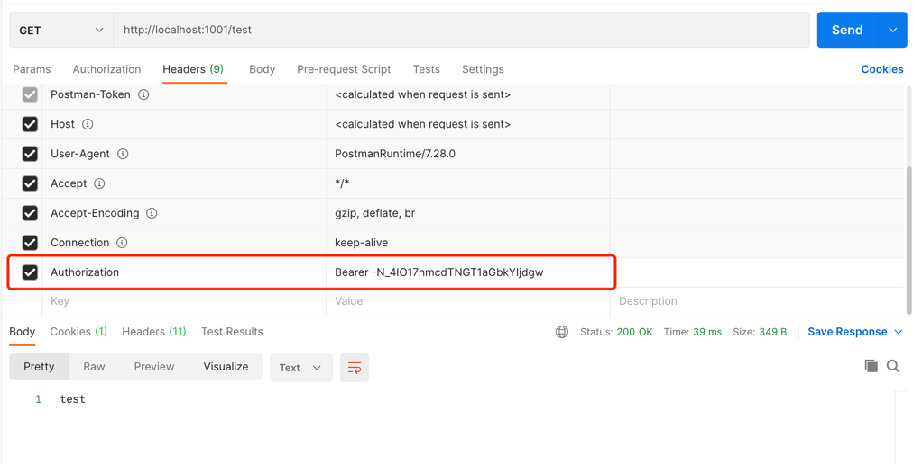

v1版本：

└── oauth_auth

    ├── config      认证服务器相关配置信息
    ├── other       自定义异常输出
    └── service     继承UserDetailsService的实现
└── oauth_client

    ├── config      资源服务器相关配置信息
    └── controller  测试控制器
└── oauth_common

    ├── dao         dao层
    ├── data        实体类层(包括入参和反参模型,个人喜好这样写)
    │     ├── dto
    │     ├── entity
    │     └── vo
    ├── other       其他公共部分
    └── util        公共工具类
└── other           项目外其他资料

主要maven依赖及版本
springboot  |   mybatis-plus    |   oauth2          ｜   redis
2.5.0       |   3.4.2           |   2.5.1.RELEASE   ｜   2.5.0

主要实现功能及介绍
本次版本较为基础的实现了oauth2的认证功能，其中以oauth_auth为认证服务器，oauth_client为资源服务器。
认证端目前实现授权码模式和密码模式，其结果生成的access_token，在资源端请求头部中带上即可访问。

密码模式流程:(以postman为例)

由于本次认证默认PasswordEncoder方式为NoOpPasswordEncoder模式(即不加密方式)，
因此都以明文方式传递password和client_secret

授权码模式流程:(以浏览器+postman为例)

获取访问/oauth/authorize 接口获取code，由于没有登录，页面跳转至/login页面

输入账户密码，登录成功后，跳转至授权页面

选择Approve，点击确认，此时跳转至百度页面，同时地址栏带上code    (此处跳转地址配置参考表oauth_client_details的web_server_redirect_uri字段)

将返回的code通过postman调用接口/oauth/token获取token

最后带上access_token请求资源端接口
