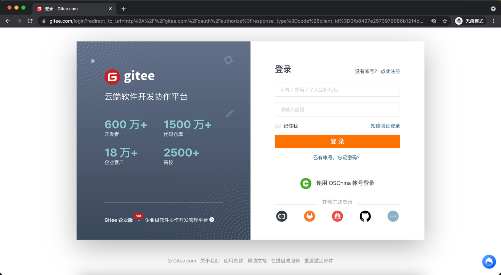
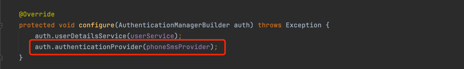
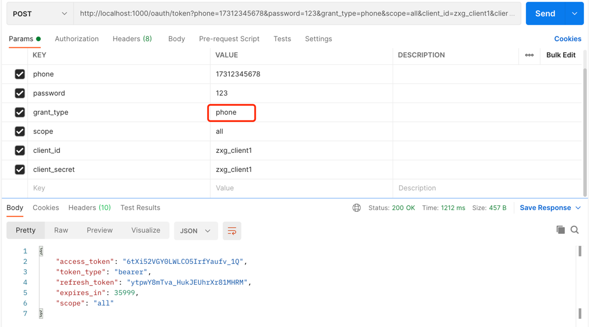
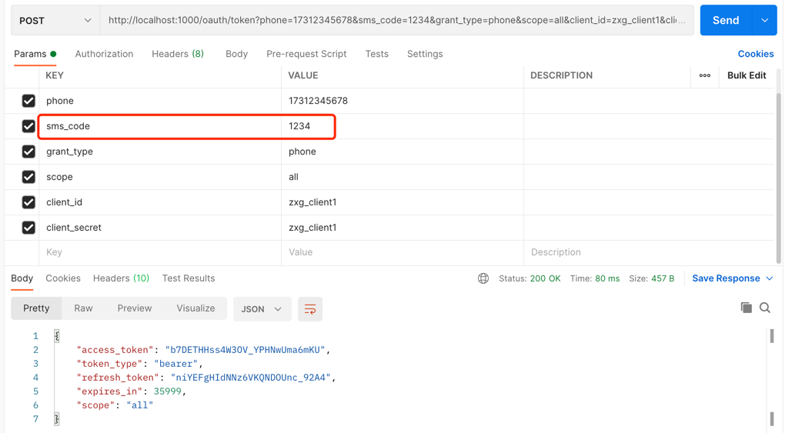

v2版本：

└── oauth_auth
    ├── config      认证服务器相关配置信息
    ├── other       自定义异常输出及其他
    │   ├── provider 自定义登录方式逻辑处理
    │   └── TokenGranter 自定义登录方式
    └── service     继承UserDetailsService的实现
└── oauth_client
    ├── config      资源服务器相关配置信息
    └── controller  测试控制器
└── oauth_common
    ├── dao         dao层
    ├── data        实体类层(包括入参和反参模型,个人喜好这样写)
    │   ├── constant
    │   ├── dto
    │   ├── entity
    │   └── vo
    ├── other       其他公共部分
    │   └── token 自定义登录方式的token生成策略
    └── util        公共工具类
└── other           项目外其他资料

主要maven依赖及版本
springboot  |   mybatis-plus    |   oauth2          ｜   redis
2.5.0       |   3.4.2           |   2.5.1.RELEASE   ｜   2.5.0

主要实现功能及介绍
本次版本在V1版本的基础上，新增了自定义（手机号+密码）+（手机号+验证码）的登录方式。
大致实现是参考密码登录方式，修改token的生成策略，以及校验方式来实现

自定义手机模式流程:(以postman为例)
由于本次认证默认PasswordEncoder方式为NoOpPasswordEncoder模式(即不加密方式)，
因此都以明文方式传递password和client_secret

1.先构建生成token的类MobileAuthenticationToken，此类参考密码模式的生成token类UsernamePasswordAuthenticationToken

2.构建自定义登录方式生成token的类MobileCustomTokenGranter，参考密码模式的ResourceOwnerPasswordTokenGranter

3.构建自定义登录方式逻辑处理的类MobileProvider，参考密码模式的RemoteAuthenticationProvider

4.打开认证服务器的配置，在设置token生成者中加添自定义手机验证方式，如图

5.打开SecurityConfig配置，添加自定义手机号验证逻辑方式，如图

6.打开postman测试手机号+密码效果,grant_type选择为phone，如图

7.打开postman测试手机号+验证码效果,grant_type选择为phone，参数password改为sms_code，如图

关于资源端如何验证token的正确性，请前往V1分支的readme.me查看